# Architecture Overview

This document provides a comprehensive overview of MCP-Compose's architecture, design decisions, and component interactions.

## Table of Contents

- [System Architecture](#system-architecture)
- [Request Flow](#request-flow)
- [Authentication Flow](#authentication-flow)
- [Protocol Translation](#protocol-translation)
- [Container Orchestration](#container-orchestration)
- [Session Management](#session-management)
- [Component Descriptions](#component-descriptions)
- [Design Decisions](#design-decisions)

## System Architecture

MCP-Compose follows a layered architecture with clear separation of concerns:

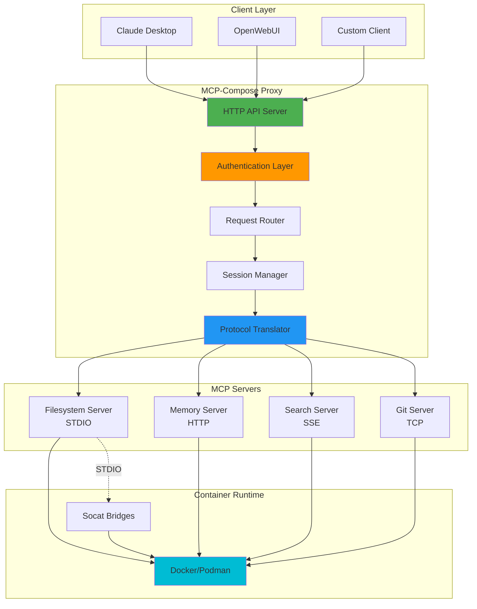

## Request Flow

### HTTP Request Processing

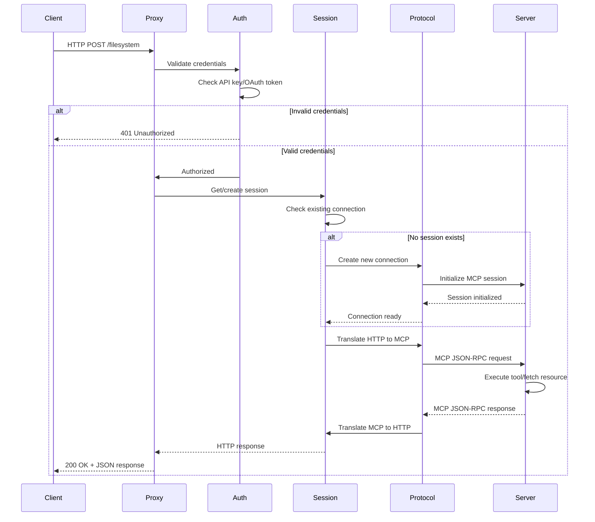

### Tool Execution Flow

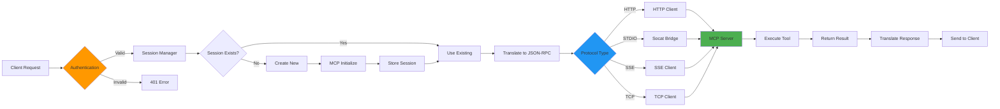

## Authentication Flow

### OAuth 2.1 with PKCE

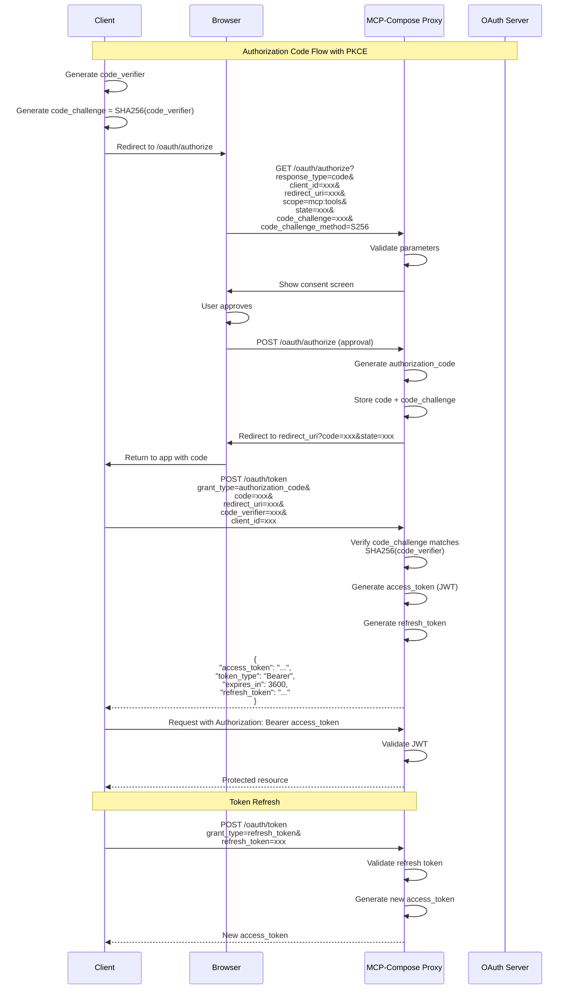

### API Key Authentication

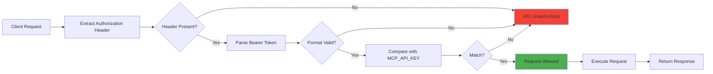

## Protocol Translation

MCP-Compose translates between HTTP and various MCP transport protocols:

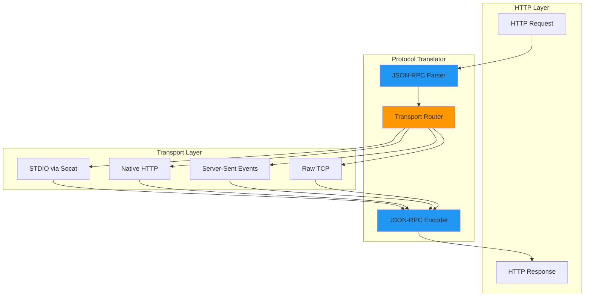

### STDIO Protocol Bridge

STDIO servers communicate via standard input/output, which MCP-Compose bridges to TCP using socat:

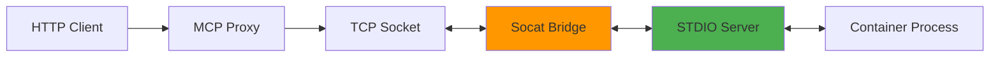

Process:
1. Container starts with socat listening on TCP port
2. Socat forwards TCP to server's STDIO
3. Proxy connects via TCP, translates HTTP to JSON-RPC
4. JSON-RPC flows through socat to server's stdin
5. Server writes response to stdout, flows back through socat

## Container Orchestration

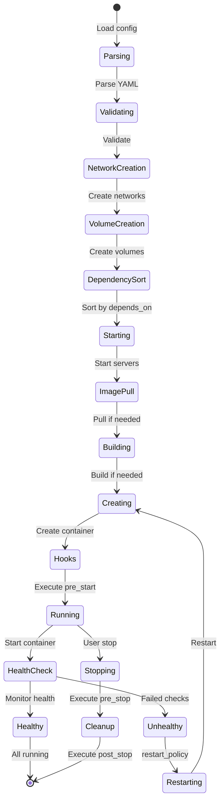

### Dependency Resolution

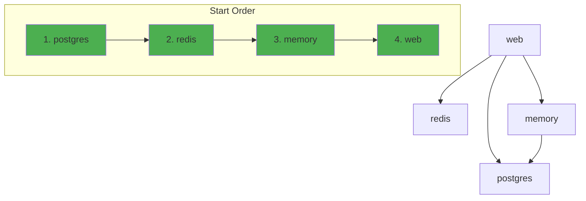

## Session Management

MCP-Compose maintains persistent sessions between the proxy and MCP servers:

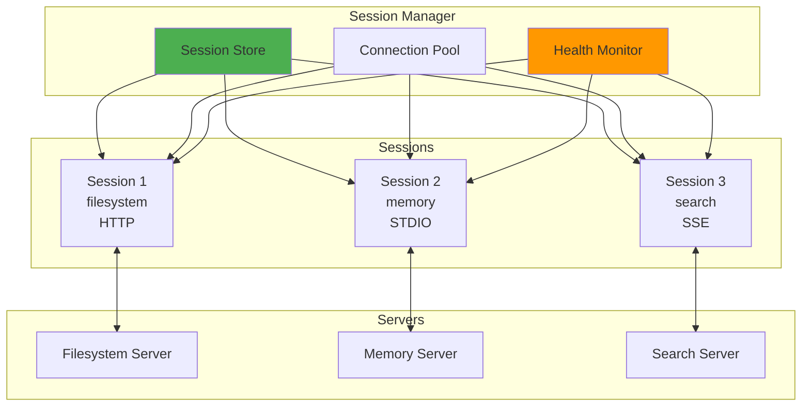

### Session Lifecycle

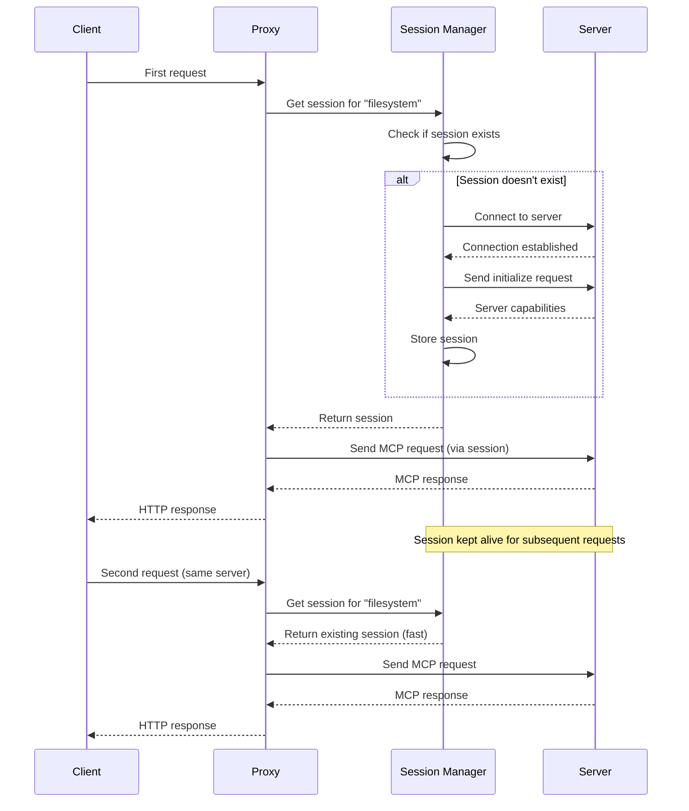

## Component Descriptions

### HTTP API Server

**Location:** `internal/server/proxy.go`

Responsibilities:
- HTTP request handling
- Route matching and dispatch
- OpenAPI specification generation
- CORS configuration
- Error handling and logging

Key features:
- RESTful API endpoints
- WebSocket support for real-time communication
- Automatic OpenAPI documentation per server
- Request/response logging

### Authentication Layer

**Location:** `internal/auth/`

Components:
- `api_key.go` - API key validation
- `oauth.go` - OAuth 2.1 server implementation
- `middleware.go` - Authentication middleware
- `jwt.go` - JWT token generation and validation

Features:
- API key authentication
- OAuth 2.1 with PKCE
- JWT-based access tokens
- Refresh token rotation
- Token revocation
- RBAC integration

### Session Manager

**Location:** `internal/server/session_manager.go`

Responsibilities:
- Connection pooling
- Session lifecycle management
- Health monitoring
- Automatic reconnection
- Connection cleanup

Features:
- Persistent connections to MCP servers
- Per-server session isolation
- Idle connection cleanup
- Health check integration
- Graceful shutdown

### Protocol Translator

**Location:** `internal/protocol/`

Components:
- `translator.go` - Core translation logic
- `http_client.go` - HTTP transport
- `stdio_client.go` - STDIO transport (via socat)
- `sse_client.go` - SSE transport
- `tcp_client.go` - TCP transport

Features:
- HTTP to JSON-RPC translation
- Protocol-specific connection handling
- Request/response streaming
- Error mapping
- Timeout management

### Container Runtime

**Location:** `internal/container/`

Components:
- `runtime.go` - Runtime abstraction interface
- `docker.go` - Docker implementation
- `podman.go` - Podman implementation
- `manager.go` - Lifecycle orchestration

Features:
- Docker and Podman support
- Image building and pulling
- Container lifecycle management
- Network creation and management
- Volume management
- Health check execution

### Configuration Manager

**Location:** `internal/config/`

Components:
- `config.go` - Configuration structures
- `validation.go` - Validation logic
- `loader.go` - YAML parsing

Features:
- YAML configuration parsing
- Environment variable expansion
- Configuration validation
- Environment-specific overrides
- Default value handling

## Design Decisions

### Why Docker/Podman?

**Decision:** Use containerization as the primary deployment model.

**Rationale:**
- Consistent environment across platforms
- Dependency isolation
- Resource limits and security controls
- Easy distribution and updates
- Familiar to developers (Docker Compose-style)

**Trade-offs:**
- Requires Docker/Podman installation
- Slightly higher resource usage
- Additional layer of complexity

### Why HTTP Proxy?

**Decision:** Expose all MCP servers through a unified HTTP proxy.

**Rationale:**
- Single endpoint for clients
- Protocol translation (STDIO/SSE/TCP to HTTP)
- Centralized authentication and authorization
- Session management and connection pooling
- OpenAPI documentation generation
- CORS and security headers

**Trade-offs:**
- Additional network hop
- Slight latency increase (~5-10ms)
- Single point of failure (mitigated by health checks)

### Why Session Persistence?

**Decision:** Maintain persistent connections between proxy and servers.

**Rationale:**
- Avoid repeated MCP initialize handshakes
- Better performance for sequential requests
- Maintain server-side state across requests
- Support for streaming operations

**Trade-offs:**
- Memory overhead for session storage
- Complexity in cleanup and health monitoring
- Potential for stale connections

### Why YAML Configuration?

**Decision:** Use YAML for configuration with Docker Compose-style syntax.

**Rationale:**
- Familiar to Docker users
- Human-readable and writable
- Comments support
- Good tooling ecosystem
- Environment variable expansion

**Trade-offs:**
- YAML parsing complexity
- Indentation sensitivity
- Limited validation at parse time

### Why OAuth 2.1 with PKCE?

**Decision:** Implement full OAuth 2.1 specification with PKCE.

**Rationale:**
- Industry-standard authentication
- Supports multiple clients and applications
- Secure for native/mobile apps (PKCE)
- Fine-grained access control (scopes)
- Token refresh and revocation

**Trade-offs:**
- More complex than simple API keys
- Requires token management
- OAuth flow adds setup complexity

### Why Multiple Protocols?

**Decision:** Support STDIO, HTTP, SSE, and TCP transports.

**Rationale:**
- STDIO: Legacy MCP server compatibility
- HTTP: Modern, stateless, easy to debug
- SSE: Real-time streaming, server-push
- TCP: Raw connections for custom protocols

**Trade-offs:**
- Multiple code paths to maintain
- Different error handling per protocol
- Testing complexity

## Performance Characteristics

### Latency

- HTTP Proxy overhead: 5-10ms (p50), 15-30ms (p99)
- STDIO translation: +2-5ms (socat overhead)
- Session reuse: ~0ms (no reconnection)
- Cold start: 100-500ms (initialize + first request)

### Throughput

- Concurrent connections: 1000+ per server
- Request rate: 10,000+ req/sec (HTTP protocol)
- STDIO throughput: Limited by socat buffer (typically 500-1000 req/sec)

### Resource Usage

- Proxy memory: 50-100MB base + ~1MB per active session
- Container overhead: ~10MB per container
- Network overhead: Minimal (<1% CPU for routing)

## Scalability Considerations

### Horizontal Scaling

MCP-Compose can be scaled horizontally by:
1. Running multiple proxy instances behind a load balancer
2. Using shared session storage (Redis/PostgreSQL)
3. Deploying replicas of MCP servers

### Vertical Scaling

Resource limits can be adjusted per server:
```yaml
deploy:
  resources:
    limits:
      cpus: "2.0"
      memory: "2g"
```

### High Availability

For production deployments:
1. Run multiple proxy instances
2. Use external session storage
3. Configure health checks and auto-restart
4. Set up monitoring and alerting
5. Use deployment strategies (rolling updates)

## Security Architecture

### Defense in Depth

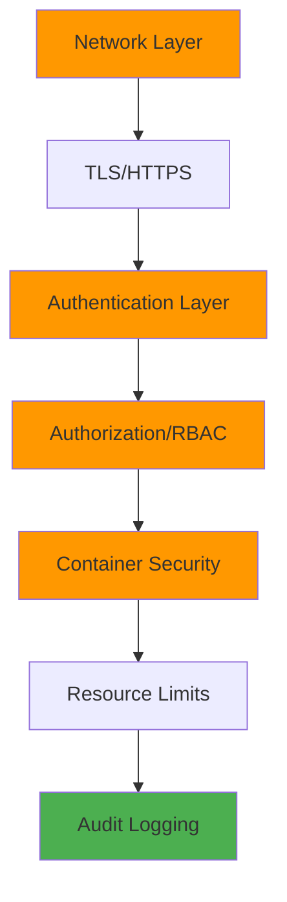

Layers:
1. Network security (TLS, firewall)
2. Authentication (API key, OAuth)
3. Authorization (RBAC, scopes)
4. Container isolation (user namespaces, capabilities)
5. Resource limits (CPU, memory, PIDs)
6. Audit logging (all operations tracked)

## Monitoring and Observability

### Metrics

Prometheus-compatible metrics:
- Request count and latency
- Error rates
- Active connections
- Session pool utilization
- Container resource usage

### Logging

Structured JSON logging:
- Request/response logs
- Authentication events
- Error traces
- Audit events

### Health Checks

Multiple health check levels:
- Container health (Docker healthcheck)
- Server health (MCP protocol check)
- Proxy health (HTTP endpoint)

## Future Architecture Considerations

Potential improvements for future versions:

1. **Kubernetes Support** (branch `kubernetes-native`)
   - Custom Resource Definitions (CRDs)
   - Operators for automated management
   - Service mesh integration

2. **Distributed Tracing**
   - OpenTelemetry integration
   - Request tracing across services
   - Performance profiling

3. **Advanced Caching**
   - Response caching
   - Tool result memoization
   - Distributed cache (Redis)

4. **Plugin System**
   - Custom authentication providers
   - Protocol extensions
   - Middleware plugins

5. **Multi-Tenancy**
   - Per-tenant isolation
   - Quota management
   - Billing integration